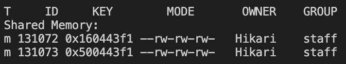
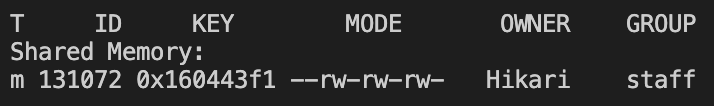

# Shared memory object

```SMObject.cpp``` and ```SMObject.hpp``` are intended to be the alternative to the sample code written for Windows. It provides similar interfaces, but uses different system calls to handle shared memory.

## Creating and accessing shared memory
Initialise SMObject by calling SMObject constructor.
```
using namespace SMObjectSpace;
SMObject::SMObject(
    const char* path,       // Valid path to a existing file.
    const char proj_id,     // unique id for that shared memory segment.
    int size                // size of shared memory.
);
```
Then create shared memory with ```shmCreate()``` and access shared memory with ```shmAccess()```.

> Note: When you want to create a shared memory, you must include an absolute path to a file (any file, but it must exist), and a byte-sized id (i.e. ```char``` variable). Under the hood, for different programs to share memory they must use the same "key" to access it. This makes sure that only desired processes have access to the memory. In essense, absolute path and the id are used together to create a unique id for the shared memory. Refer to example code for usage.

## Error checking/ debugging
Both ```shmCreate()``` and ```shmAccess()``` sets ```error_handle_``` to appropriate ```errno``` or custom error value. To take full advantage of custom errors, use ```pError()``` instead of standard ```perror()```.

## Note on Memory leak
If the process/program terminates successfully (controller termination, so that destructor ```~SMObject()``` is called), it should take care of freeing or not freeing the shared memory. e.g. if another process is currently using the shared memory, it will not free the memory upon exiting of the program.

This is achieved simply by keeping track of how many processes have access to the shared memory, using ```*pmem_ctr_```. Upon successful call of ```shmAccess()```, ```*pmem_ctr_``` is incremented, and upon successful call of ```~SMObject()``` (upon successful termination of a process) it will decrement the counter.

You do however, need to make sure if a process terminates unexpectedly, you decrement the counter manually in your code with ```decrementMemCtr()```.

## Removing leaked memory

There will be times (particularly during development/debugging) shared memory doesn't get cleaned up correctly. This may be due to unexpected termination of program, or forgetting to call ```decrementMemCtr()``` appropriately.

Here are useful terminal commands for shared memory.

- ```ipcs```: IPC status. Checks for existing shared memory
- ```ipcrm -M key_```: removes memory from given key
- ```ipcrm -m ID```: removes memory from assigned ID

### Usage example

Let's run ```ipcs``` command.

```$ ipcs```
This will output with three sections: Message Queues, Shared Memory and Semaphores. We only care aobut Shared Memory section for now. If you haven't run any of the shared memory code yet, you should see nothing in Shared Memory section.


Now let's compile and run ```reader.cpp```

```
$ g++ reader.cpp SMObject.cpp -o reader
$ ./reader
```

Open up another terminal, and run ```ipcs``` again (don't quit ```reader``` yet). You should now see a shared memory is now created.



> How come there are two shared memories? This is because of how ```SMObject``` class works. One of the shared memory is the one you need for your program (reader), and other shared memory is a counter to keep track of how many processes have access to it, and when to free the shared memory.

Now, if you exit the ```reader``` program successfully e.g. press Q and enter, you should see the shared memory disappear when you re-run ```ipcs```. But, if you exit the ```reader``` program unsuccessfully e.g. ctrl-C, you will see those shared memory remaining -  memory leak!

When this happens, you can use ```ipcrm``` manually to remove the leaked shared memory.

```
$ ipcrm -M 0x500443f1   // remove using the key
```
Below is equivalent to above
```
$ ipcrm -m 131073       // remove using the ID
```
Either way is fine, its really up to you.

Now you should see one of the shared memory is successfully removed.



Proceed to remove the other memory as well.

## Useful resources

I highly recommend Beej's guide to shared memory and TCP!

Shared memory: http://beej.us/guide/bgipc/html/multi/shm.html#shmcreat

TCP/IP: http://beej.us/guide/bgnet/html/
